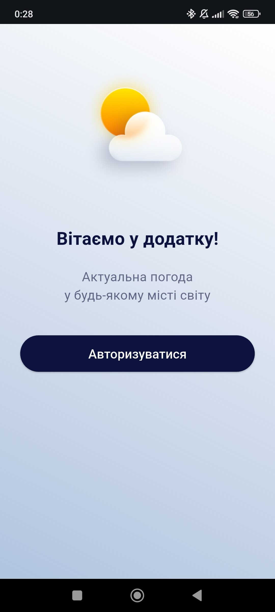
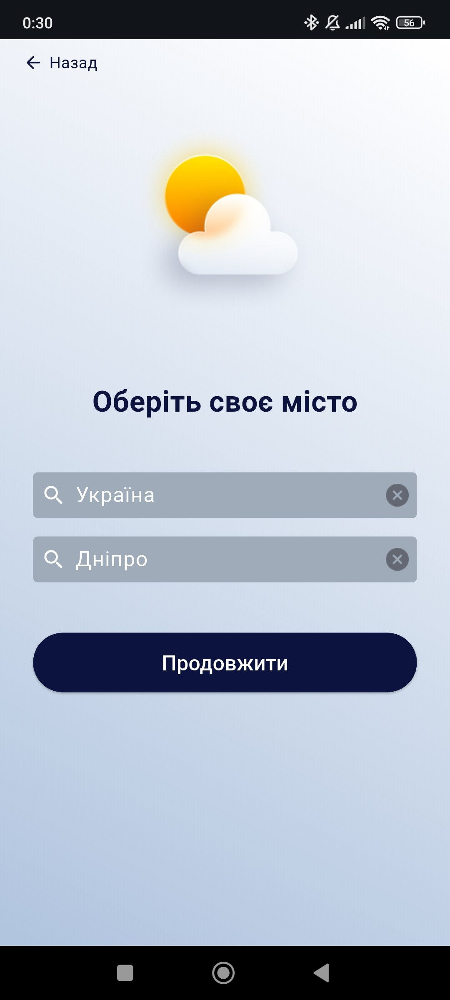
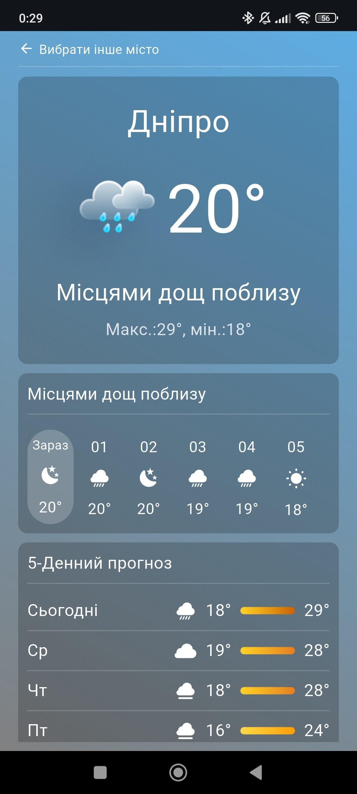

# Weather Client

Мобільний застосунок для перегляду погоди, реалізований за допомогою Flet.

Застосунок дозволяє користувачу зареєструватися, підтвердити електронну пошту, обрати країну та місто, після чого переглядати поточну погоду, погодинний прогноз та прогноз на 5 днів.

---
## Зміст

1. [Основні можливості](#1-основні-можливості)
2. [Інтерфейс](#2-Інтерфейс)
3. [Архітектура застосунку](#3-архітектура-застосунку)
4. [Структура проєкту](#4-структура-проєкту)
5. [Використані API](#5-використані-api)
6. [Логіка зміни фону](#6-логіка-зміни-фону)
6. [Змінні середовища](#7-змінні-середовища)
8. [Запуск проєкту](#8-запуск-проєкту)
9. [Серверна частина](#9-серверна-частина)
10. [Розробник](#10-розробник)

---
## 1. Основні можливості

### Аутентифікація

- реєстрація користувача;
- авторизація;
- підтвердження електронної пошти через код;
- JWT авторизація;
- автоматичне оновлення токенів.

### Вибір локації

- отримання списку країн із Backend API;
- отримання списку міст через GeoNames API;
- збереження вибраної локації у профілі користувача.

### Погода

- поточна погода;
- погодинний прогноз на поточний день;
- прогноз на 5 днів;
- автоматичне оновлення поточної погоди кожні 15 хвилин.

### Інтерфейс

- адаптивний UI на Flet;
- зміна фону залежно від погодних умов;
- використання погодних SVG та PNG іконок;
- модульна структура компонентів.

---
## 2. Інтерфейс

### Вітальна сторінка

> Початковий екран застосунку для неавторизованих користувачів.

### Сторінка вибору країни та міста 

> Вибір країни та міста для подальшого отримання погодних даних.

### Головна сторінка

> Основний екран застосунку. Містить:  
    - поточну погоду;  
    - погодинний прогноз;  
    - прогноз на 5 днів.  

Детальніше дизайн можна переглянути за цим посиланням: https://www.figma.com/design/VYk2DcZ9wOC0arFSz5lSLy/Weather-Project?node-id=0-1&t=GQM1E88GZP8ihNiY-1

---
## 3. Архітектура застосунку

```
Flet Application 
│ 
├── Pages 
│    ├── Welcome 
│    ├── Login 
│    ├── Register 
│    ├── Verify Email 
│    ├── Country & City Select 
│    └── Home 
│ 
├── Components 
│    ├── Inputs  
│    ├── Buttons 
│    ├── Current Weather 
│    ├── Hourly Weather 
│    └── Daily Weather 
│ 
├── Services 
│    ├── Auth Service 
│    ├── Weather Service 
│    └── Location Service 
│ 
├── Core 
│    ├── API Client 
│    ├── Router 
│    ├── Auth Manager 
│    └── Config 
│ 
└── External APIs 
    ├── Backend API 
    ├── GeoNames 
    ├── WeatherAPI 
    └── OpenWeatherMap
```

---
## 4. Структура проєкту

```
┌──assets/
├──main.py
└──modules/
```
### assets

Містить:
- іконки погоди;
- SVG ресурси;
- PNG ресурси;
- зображення інтерфейсу.

### modules/components

Повторно використовувані UI-компоненти:
- кнопки;
- поля вводу;
- блок поточної погоди;
- блок погодинного прогнозу;
- блок прогнозу на 5 днів.

### modules/pages

Сторінки застосунку:
- welcome;
- login;
- register;
- verify_email_page;
- country_city_select;
- home.

### modules/services

Робота із зовнішніми API:
- auth_service;
- location_service;
- weather_service.

### modules/core

Базова інфраструктура застосунку:
- api_client;
- auth_manager;
- router;
- config;
- container.

### modules/utils

Допоміжні інструменти:
- валідатори;
- debounce;
- helper функції.

---
## 5. Використані API

### Backend API

Використовується для:

- реєстрації;
- авторизації;
- підтвердження пошти;
- отримання списку країн;
- отримання та оновлення профілю користувача.

Репозиторій: [Backend API](https://github.com/glib-pronin/Weather-Server)

### GeoNames API

Використовується для отримання списку міст.

Документація: https://www.geonames.org/export/geonames-search.html

Приклад запиту:
``` http
GET http://api.geonames.org/searchJSON?country=UA&featureClass=P&maxRows=20&username=USERNAME
```
### WeatherAPI

Використовується для:

- поточної погоди;
- погодинного прогнозу.

Документація: https://www.weatherapi.com/docs/

Приклад запиту:
``` http
GET https://api.weatherapi.com/v1/forecast.json?key=API_KEY&q=lat,lng&days=1
```

### OpenWeatherMap

Використовується для отримання прогнозу на 5 днів.

Документація: https://openweathermap.org/forecast5

Приклад запиту:
``` http
GET https://api.openweathermap.org/data/2.5/forecast?lat=48.46&lon=35.05&appid=API_KEY
```

---
## 6. Логіка зміни фону

Колір головного екрану змінюється залежно від погодних умов.

|Тип погоди|Код іконки|Колір фону|
|----------|----------|----------|
|Сонячна|01d, 02d|градієнт #87CEFA, #FFDF56|
|Ніч|01n, 02n|градієнт #191970, #8A2BE2|
|Мала хмарність (день)|03d|градієнт #C0C0C0, #FFD27F|
|Мала хмарність (ніч)|03n|градієнт #696969, #9974BC|
|Хмарність|04d, 04n|градієнт #A9A9A9, #696969|
|Дощ|09n, 09d, 10d, 10n|градієнт #808080, #5DACE2|
|Злива|11d, 11n|градієнт #4A4A4A, #5DACE2|
|Сніг|13d, 13n|градієнт #FFFFFF, #B0C4DE|

---
## 7. Змінні середовища

Створіть файл `.env` у корені проєкту:
```
BASE_URL='http://127.0.0.1:8000/'

GEONAMES_USERNAME='your_geonames_username'
OPENWEATHER_API_KEY='your_openweather_api_key'
WEATHER_API_KEY='your_weather_api_key'
```

---
## 8. Запуск проєкту

1. Клонування репозиторію
```
git clone https://github.com/glib-pronin/Weather-Client.git
cd Weather-Client
```

2. Створення віртуального середовища
```
python -m venv venv
source venv/Scripts/activate
```

3. Встановлення залежностей
```
pip install -r requirements.txt
```

4. Запуск застосунку  

    - Для Android: 
    ```
    flet run --android
    ```
    - Для IOS: 
    ```
    flet run --IOS
    ```
    - Для Desktop: 
    ```
    python main.py
    ```

---
## 9. Серверна частина

Для роботи застосунку необхідно запустити серверну частину: [Backend API](https://github.com/glib-pronin/Weather-Server)

---
## 10. Розробник

- Ім’я: Гліб Пронін
- Роль: Розробник клієнтської частини для мобільного застосунку погоди
- GitHub: [glib-pronin](https://github.com/glib-pronin/)